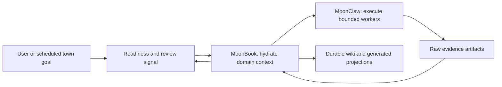
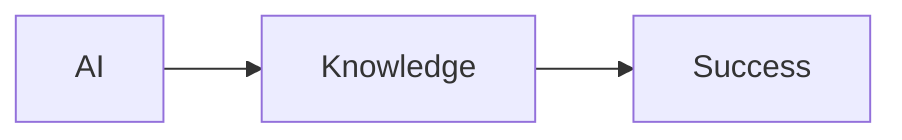
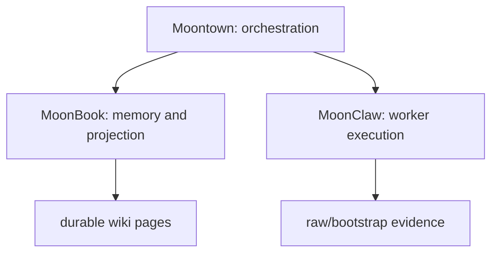

# Research Report Skill

Use this skill when a MoonBook keeper, MoonClaw worker, or Moontown lane needs to turn gathered material into a high-quality research article.

This skill is not for fetching sources. It is for synthesis after collection has produced enough raw material. If source collection is missing, write a blocker and ask for the missing artifacts instead of inventing a report.

## Non-Negotiable Output

Always write `raw/bootstrap/deep-report.md` when the evidence matrix exists.

`deep-report.md` is the article draft that MoonBook will later materialize into `wiki/synthesis/report.md` and project into the generated website.

The report must be long-form, not a card list. It should feel closer to a deep-research article than a status dashboard.

Hard structural requirements:

- The title must be `# <Topic>: Deep Research Analysis`.
- The title must not contain `bootstrap`, `dossier`, `envelope`, `run`, `artifact`, or `workspace state`.
- Use explicit `##` section headings. Do not write a long report as headingless paragraphs.
- A single-topic report must contain at least 8 `##` sections.
- A town-level or multi-project report must contain at least 10 `##` sections.
- The first `##` section must be `## Executive Summary`.
- The first paragraph must explain the subject, not the research process.
- Process/tool limitations belong only in the final `## Evidence and Limits` section unless they invalidate the thesis.

Minimum accepted shape:

- 1 direct executive summary paragraph
- 1 context paragraph
- one thesis-driven section per major subject
- one integration/relationship section
- one technical resources or implementation section
- one comparison/positioning section
- one maturity/gap section
- one evidence section
- at least 14 substantive paragraphs total when evidence is available
- at least 3 concrete claims per major subject when source material exists
- measurable facts when present in evidence, such as language composition, stars, commit counts, package versions, dates, directory counts, or module names
- source IDs on strong claims
- at least one table when comparing projects, capabilities, maturity, or sources
- one Mermaid diagram block when relationships are central to the topic

If you cannot write this, return a structured blocker. Do not return generic completion text.

Reject and revise before success if the draft:

- has fewer than 8 `##` headings for a single-topic report
- has no table
- has no Mermaid diagram or relationship model
- starts with "bootstrap", "this pass", "this dossier", or "this workspace"
- uses the same generic relationship paragraph that could apply to every project
- spends more than 20% of the main body describing process, search limitations, or artifact contracts

## Goal

Produce a report that reads like a real research article:

- clear question
- executive summary
- defensible thesis
- topic explanation
- architecture and operating model
- relationship to adjacent components
- concrete implementation details
- comparison by responsibility and tradeoff
- maturity and gaps
- evidence table
- explicit limits

The report should be useful to a reader who has not seen the workspace internals.

The quality target is a polished deep-research article, not a workspace status page. The reader should feel that the writer understands the subject, has inspected evidence, and can explain why the system matters.

## Required Inputs

Load these files if they exist:

- `raw/bootstrap/research-question.md`
- `raw/bootstrap/search-log.md`
- `raw/bootstrap/source-screen.md`
- `raw/bootstrap/evidence-matrix.md`
- `raw/bootstrap/local-sources.md`
- `raw/bootstrap/synthesis-brief.md`
- `wiki/index.md`
- `wiki/sources/*.md`
- `wiki/entities/*.md`
- `wiki/concepts/*.md`
- `wiki/synthesis/overview.md`
- `wiki/synthesis/map.md`
- `wiki/synthesis/evidence.md`

If the workspace includes multiple project books, read the sibling book summaries only when explicitly instructed by the town-level packet. Do not leak private memory between unrelated books.

## Required Outputs

At minimum, produce or revise:

- `raw/bootstrap/deep-report.md`
- `raw/bootstrap/synthesis-brief.md`
- `wiki/synthesis/overview.md`
- `wiki/sources/research-evidence.md`

When the evidence is strong enough, also create or revise:

- `wiki/entities/<topic>.md`
- `wiki/concepts/<important-concept>.md`
- `wiki/synthesis/report.md`

If the report is blocked, write the blocker into:

- `wiki/history/debug-journal.md`
- `wiki/synthesis/evidence.md`

## Report Shape

Use this section order unless the user asks for a different format:

1. Executive summary
2. Research question and scope
3. Ecosystem overview and foundational context
4. What the topic is
5. Architecture
6. Runtime or operating model
7. Memory, state, and persistence
8. Tools, interfaces, and integrations
9. Inter-system integration and architectural relationships
10. Technical documentation and development resources
11. Comparison and positioning
12. Maturity assessment
13. Recent development themes
14. Future evolution vectors
15. Evidence table

For a single-topic report, prefer this exact Markdown heading skeleton:

```markdown
# <Topic>: Deep Research Analysis

## Executive Summary

## Research Question and Scope

## Ecosystem Context

## Core Role and Product Thesis

## Architecture and Components

## Operating Model

## Integration With Adjacent Systems

## Implementation Evidence

## Comparison and Positioning

## Maturity Assessment

## Future Evolution

## Evidence and Limits
```

You may rename headings only when the source material clearly calls for a better reader-facing title. Do not remove the section structure.

For a town-level report covering Moontown, MoonBook, and MoonClaw together, use this section order:

1. Executive summary
2. Ecosystem overview and foundational context
3. MoonBook: documentation and knowledge infrastructure
4. MoonClaw: agent runtime and job orchestration
5. Moontown: orchestration layer and control plane
6. Inter-system integration and architectural relationships
7. Technical documentation and development resources
8. Comparative and contextual analysis
9. Current status and development trajectory
10. Evidence and limits

This section shape is a quality target, not hard-coded content. Fill it from the evidence matrix and source pages.

## Article Quality Rubric

Before writing, grade the available material against this rubric:

| Dimension | Strong output | Weak output |
| --- | --- | --- |
| Thesis | Opens with a clear interpretation of the topic and why it matters | Opens with "this bootstrap pass" or "the workspace contains" |
| Specificity | Names concrete files, packages, APIs, workflows, roles, and boundaries | Uses generic words like platform, workspace, maintained, durable, automated |
| Structure | Moves from context to architecture to evidence to maturity | Alternates between process notes and loose bullet summaries |
| Synthesis | Explains relationships and tradeoffs across sources | Repeats source rows without interpretation |
| Evidence | Uses source IDs naturally after claims | Dumps citations after every sentence or omits them |
| Reader value | Teaches a new reader what the system is and how it works | Only proves that a pipeline ran |

If the report scores weak on thesis, specificity, or synthesis, revise before returning success.

## Kimi-Level Shape Target

The report should compete with a high-quality deep-research page. That means it should contain:

- a compact title that names the subject and analysis type
- an executive summary that answers the research question directly
- an ecosystem overview that explains the project in context
- a core architecture section with responsibility boundaries
- implementation or runtime sections with file-backed details
- quantitative fact cards or tables when evidence exposes reliable metrics
- a relationship section explaining how adjacent systems interact
- a comparison section that describes tradeoffs without unsupported product ranking
- a maturity section that distinguishes implemented, emerging, and missing capabilities
- an evidence/limitations section that is transparent but not the main story

Do not copy any external report. Use this as a shape and quality target only.

## Page Assembly Contract

MoonBook will project `raw/bootstrap/deep-report.md` directly into the generated
site. Treat this file as the article body a reader will see, not as an internal
note for another agent.

The generated page is strongest when `deep-report.md` already contains the
reader-facing structure. Do not rely on the renderer to invent missing content.
The renderer is allowed to format headings, tables, and diagrams; it must not be
expected to turn weak bullets into a strong article.

Write the report so it can stand alone in a browser:

- first screen: title, executive summary, and the central thesis
- early body: ecosystem context and fact sheet when metrics exist
- middle body: architecture, operating model, relationships, and technical proof
- later body: comparisons, maturity, trajectory, and open gaps
- final body: evidence and limits

The page should not have empty sections. If a section lacks enough evidence,
write a short evidence-aware paragraph explaining the gap and what source would
resolve it. Do not leave placeholder headings, generic bullets, or "None yet."

## Deep Article Minimums

When the evidence matrix has at least five usable rows, the report must include:

- at least 2 paragraphs in the executive summary section
- at least 1 compact fact table if there are three or more reliable facts
- at least 1 Mermaid diagram for architecture or relationship flow
- at least 1 comparison or maturity table
- at least 10 source-backed paragraphs across the body
- at least 1 paragraph explaining what evidence is local-only, public-web,
  inferred, or provisional

For the MoonBook/MoonClaw/Moontown stack, a Kimi-standard town-level report must
contain all three project sections, even if one project has weaker evidence. If
one project is weak, state that as a maturity/evidence limitation; do not omit
the project.

## Anti-Shell Rule

The report must not read like a workspace shell. These phrases are allowed only
in the final evidence/limits section or debug notes:

- "generated site"
- "research envelope"
- "artifact contract"
- "bootstrap"
- "review queue"
- "coverage readiness"
- "provider returned"
- "MoonBook will materialize"

If those phrases appear in the executive summary or early body, rewrite. The
reader came to understand the subject, not the pipeline.

## Section Depth Requirements

Each section must contain at least one of:

- a named subsystem, file, module, command, or API
- a sourced measurable fact
- a cross-system relationship or boundary
- a tradeoff or maturity judgment supported by evidence

If a section contains only generic benefit language, delete it or replace it
with evidence-backed analysis.

Good section paragraph:

> MoonClaw's provider-task bridge is the runtime boundary that lets a book-local
> provider shape domain work while MoonClaw keeps execution, artifacts, lineage,
> and review signaling generic. The evidence is concrete: the provider task
> result schema carries `task_id`, `summary`, `artifacts`, `memory_candidates`,
> `requires_review`, and `notify_town` [L5].

Bad section paragraph:

> MoonClaw provides a powerful and flexible platform for reliable AI workflows.

## Evidence-to-Article Transformation

Do not paste evidence rows into prose. Transform them:

1. Read the evidence row.
2. Decide what claim it supports.
3. Combine related rows into one explanatory paragraph.
4. Cite the row IDs at the end of the paragraph.
5. Add an inference label only when the claim is not directly stated by one
   source.

Example evidence rows:

```markdown
| L1 | README says MoonClaw has gateway, memory, jobs, ACP, and Rabbita UI |
| L5 | provider_task.mbt defines ProviderTaskResult with artifacts and memory candidates |
```

Good transformation:

> MoonClaw is not only an interaction surface; it is a job runtime with operator
> visibility. The README names gateway, memory, jobs, ACP, and Rabbita UI as
> product surfaces, while the provider-task schema shows how delegated work
> returns artifacts and memory candidates into the runtime [L1, L5].

Bad transformation:

> L1 says gateway, memory, jobs, ACP. L5 says ProviderTaskResult.

## Town-Level Synthesis Requirements

When the topic asks for several related projects, write the relationship, not
three isolated mini-reports.

For Moontown, MoonBook, and MoonClaw, always answer:

- What does each layer own?
- Which layer plans?
- Which layer stores durable memory?
- Which layer executes tools?
- Where does review happen?
- What moves between layers as a packet, result, artifact, or page?
- What should not cross the boundary?

Include a table like:

```markdown
| Layer | Owns | Does not own | Evidence |
| --- | --- | --- | --- |
| Moontown | scheduling, policy, multi-book orchestration | durable domain memory | L1, L3 |
| MoonBook | workspace semantics, skills, wiki materialization, projections | tool execution runtime | L2, L4 |
| MoonClaw | worker execution, tools, jobs, artifacts | long-term domain truth | L5, L6 |
```

Then explain the lifecycle in prose:

> A town goal becomes a book-scoped packet, the book hydrates context and skills,
> MoonClaw workers gather or execute bounded tasks, and MoonBook decides what is
> promoted into durable wiki memory. Moontown observes and schedules the next
> stage rather than directly editing book memory.

## Visual Requirements

Use Mermaid for relationships whenever the evidence supports a flow. The diagram
should clarify ownership, not decorate the page.

Good:



Bad:



Tables should explain comparison, fact sheets, maturity, or source quality.
Avoid tables that simply repeat raw source rows.

## Narrative Order

Use this writing order:

1. Decide the thesis in one sentence.
2. List the 5 to 8 strongest claims with source IDs.
3. Group claims into sections.
4. Write the article from the strongest interpretation outward.
5. Move process details, blocked searches, and tool caveats to the evidence/limits section unless they materially affect the thesis.
6. Verify every section contains at least one topic-specific claim.

Bad opening:

> This bootstrap run created a screened research envelope for MoonClaw.

Good opening:

> MoonClaw is best understood as the execution substrate of the stack: it turns proposals into durable jobs, exposes tool-backed provider execution, and returns structured artifacts that MoonBook can promote into long-term knowledge [L1, L4].

The first version describes the pipeline. The second version explains the subject.

## Deep Report Format

Write `raw/bootstrap/deep-report.md` as ordinary Markdown.

Use headings, paragraphs, lists, tables, and optional Mermaid blocks.

Preferred opening:

```markdown
# <Topic>: Deep Research Analysis

## Executive Summary

<One dense paragraph answering the research question with source IDs.>

## Ecosystem Overview and Foundational Context

<Explain the organization, stack, naming metaphor, and why this topic matters.>
```

The opening must not mention "bootstrap", "this pass", "dossier", "artifact contract", or "pipeline ran" in the first paragraph unless the topic itself is the pipeline. Those details belong later.

Bad title:

```markdown
# MoonBook Bootstrap Research Report
```

Good title:

```markdown
# MoonBook: Deep Research Analysis
```

For multi-project stack reports, include a compact table:

```markdown
| Layer | Project | Responsibility | Evidence |
| --- | --- | --- | --- |
| Knowledge | MoonBook | Durable wiki, memory, and projections | L1, L5 |
| Execution | MoonClaw | Worker runtime and provider execution | L1, L4 |
| Governance | Moontown | Cross-book orchestration and supervision | L1, L6 |
```

When relationship evidence exists, include a Mermaid diagram:



If Mermaid is not supported by the renderer, still write the code block; MoonBook can preserve or project it later.

Do not replace Mermaid with a plain `text` diagram unless the runtime explicitly cannot write Mermaid. Do not create fake diagrams. If evidence does not support a relationship, explain the missing evidence instead.

For MoonBook/MoonClaw/Moontown topics, the relationship model should use this split unless contradicted by evidence:

- Moontown decides what should happen and coordinates multi-book work.
- MoonBook owns the domain workspace, durable memory, skills, and projections.
- MoonClaw executes worker tasks, tools, provider runs, and artifacts.

## Required Section Behavior

Each major section must do real explanatory work.

Executive summary:

- answer the question in 1 to 2 paragraphs
- state the system role and why it matters
- include only high-confidence claims
- avoid caveats unless they change the answer

Architecture:

- identify core components
- explain what each component owns
- name relevant files, packages, APIs, or workflows when evidence exists
- include measurable implementation facts when available
- explain at least one boundary decision

Operating model:

- explain the lifecycle or workflow from input to output
- distinguish human, keeper, worker, and runtime responsibilities when relevant
- describe persistence and review behavior when source material supports it

Comparison and positioning:

- compare by architecture pattern, not by brand
- state tradeoffs: speed vs durability, generic runtime vs domain-specific behavior, raw evidence vs polished projection
- do not name external products unless sourced

Maturity:

- split into "implemented", "emerging", and "uncertain"
- do not call something production-ready unless evidence supports deployment, tests, release, and operational docs

Evidence and limits:

- summarize source coverage
- list blockers and false leads
- explain what a follow-up research pass should inspect next

Quantitative facts:

- Use measurable facts when the evidence contains them.
- Good examples: `96.8% MoonBit`, `24 stars`, `2,012 commits`, `version 0.1.2`, `native target`, named packages, exact CLI commands.
- Never invent metrics. If a metric is not visible in the fetched web page, local source, or evidence matrix, omit it.
- Prefer a compact "Fact Sheet" table near the top when reliable metrics exist.

Example:

```markdown
## Fact Sheet

| Fact | Value | Evidence |
| --- | --- | --- |
| Implementation language | 92.1% MoonBit | W1 |
| Module name | `vectie/moonclaw` | L2 |
| Runtime target | native | L2 |
```

## Density Requirements

When evidence exists, a single-topic report should include at least:

- 1 thesis paragraph
- 1 fact-sheet or capability table when measurable facts exist
- 4 architecture or operating-model paragraphs
- 2 implementation-detail paragraphs
- 1 relationship paragraph
- 1 comparison paragraph
- 1 maturity paragraph
- 1 evidence-limits paragraph
- 1 table or diagram

A three-project town-level report should include at least:

- 1 cross-stack thesis paragraph
- 2 paragraphs each for Moontown, MoonBook, and MoonClaw
- 2 relationship/integration paragraphs
- 1 comparative architecture table
- 1 maturity matrix
- 1 system relationship Mermaid diagram
- 1 evidence-limits section

If the source set is too weak to satisfy this density, return a blocker instead of writing a thin article.

## Evidence Rules

Every strong claim must point to evidence.

Use source IDs from `raw/bootstrap/evidence-matrix.md`, such as `L1`, `L2`, `W1`, and `W2`.

Good:

> MoonClaw is positioned as a MoonBit-native agent runtime with gateway, memory, job, and ACP control surfaces [L1].

Bad:

> MoonClaw is a revolutionary autonomous AI operating system.

If a claim is inferred from multiple files, say so:

> Inference from the README, provider-task code, and job docs: MoonClaw separates controller-level planning from provider-task execution [L1, L5, L7].

If evidence is weak, mark it:

> Provisional: local source hints suggest this direction, but no inspected implementation file confirms it yet.

Prefer source IDs in square brackets for prose, such as `[L1, L4]`. Parenthetical source IDs are acceptable, but do not over-cite every sentence. Cite the paragraph's main claim and any surprising implementation claim.

## What Not To Do

Do not dump `evidence-matrix.md` table rows as article prose.

Do not write a report whose main content is about:

- the run
- the bootstrap envelope
- the artifact contract
- tool availability
- quality gates
- whether the process completed

Those belong in `debug-journal.md`, `journey.md`, or the evidence/limits section. The report's main body must explain the subject.

Do not lead with generic phrases like:

- maintained workspace
- durable knowledge instead of disposable answers
- live marketing projection
- evidence-oriented workspace
- bootstrap pass
- screened research envelope
- source-grounded current run

Those are MoonBook product ideas, not a topic-specific research result.

Do not invent external comparisons. If external comparison sources are not in `source-screen.md` or `evidence-matrix.md`, write:

> External comparison is not supported by the current evidence set.

Do not use full prompt text as headings, review labels, or report titles.

Do not treat candidate-source inventories as verified source digestion.

Do not mark bootstrap complete if there are no source, entity, concept, or synthesis pages with topic-specific content.

Do not use "appears to be" as the default voice. Use confident language for high-confidence evidence and reserve "appears" or "suggests" for provisional claims.

Do not use `text` diagrams when a Mermaid relationship diagram is feasible. Use fenced `mermaid` blocks for system relationships.

Do not write the same relationship paragraph for all three projects. Each project needs a different angle:

- Moontown: coordination, scheduling, policy, synthesis, operator view
- MoonBook: workspace semantics, durable memory, wiki materialization, projection
- MoonClaw: task execution, provider runtime, tools, jobs, artifacts

## Source Screening

Classify every source before using it:

- `verified-source`: inspected directly and contains topic-specific evidence
- `provisional-source`: inspected but shallow or incomplete
- `candidate-source`: named by hints, search, or metadata but not inspected enough
- `false-lead`: unrelated name collision or weak search hit

Only verified and well-explained provisional sources should support report claims.

Candidate sources can appear in the evidence table, but not in the executive summary as facts.

False leads should be listed briefly when they explain why a public search result was ignored.

## Synthesis Brief Requirements

`raw/bootstrap/synthesis-brief.md` must not be a template.

It must include:

- one-paragraph answer
- 5 to 9 verified findings
- 3 to 6 architecture or relationship bullets
- 2 to 5 maturity/gap bullets
- evidence references after each important bullet
- explicit blockers if evidence is insufficient

Example:

```markdown
# Synthesis Brief

## Answer

MoonClaw is the worker-runtime layer in the town/book/claw stack. It owns task execution, provider runs, tool access, artifacts, and worker session state, while MoonBook owns durable wiki memory and Moontown owns cross-book orchestration [L1, L4, L7].

## Verified Findings

- The README describes MoonClaw as a MoonBit-native agent runtime with gateway, memory, job, and ACP remote-agent control surfaces [L1].
- The provider-task implementation shows that delegated work is normalized into structured result envelopes before downstream persistence [L5].
- Web search and fetch tools exist as distinct tool packages, so web capability should be expressed as tool availability rather than implied by local file access [L7, L8].

## Gaps

- The current evidence set does not prove production deployment maturity. More release, CI, and operator documentation is needed [L1, L4].
```

## Entity Page Requirements

When creating `wiki/entities/<topic>.md`, include:

- role
- responsibilities
- boundaries
- upstream/downstream relationships
- verified evidence
- open questions

Example:

```markdown
# MoonClaw

## Role

MoonClaw is the worker execution runtime in the Moontown/MoonBook/MoonClaw stack [L1].

## Responsibilities

- run delegated tasks
- manage provider execution
- expose tools
- package artifacts and result envelopes

## Boundaries

MoonClaw should not own durable wiki memory. Durable promotion belongs to MoonBook.
```

## Concept Page Requirements

Concept pages should explain reusable ideas, not duplicate entity pages.

Good concepts:

- provider-backed execution
- raw-first ingest
- verified source coverage
- skill-governed synthesis
- town/book/claw layering
- research artifact envelope

Each concept page should include:

- definition
- why it matters
- implementation evidence
- relationship to entities
- failure modes

## Comparison Section

Comparison is allowed only when supported.

Do:

- compare architectural patterns horizontally
- say what the system optimizes for
- describe tradeoffs
- avoid naming competitors unless sources explicitly require it

Do not:

- rank products without evidence
- mention unrelated search results as competitors
- use marketing adjectives without proof

Preferred language:

> Compared with ordinary one-shot document Q&A patterns, this system emphasizes durable workspace memory and repeated synthesis. That claim is supported inside this workspace by the wiki index, synthesis pages, and evidence matrix [L2, L6].

## Maturity Matrix

When enough evidence exists, include a compact maturity table:

```markdown
| Capability | Evidence | Status | Gap |
| --- | --- | --- | --- |
| Provider-backed execution | `job/provider_task.mbt` defines result envelopes and required artifacts [L4] | implemented | Needs broader failure-mode testing |
| Website projection | `wiki/ui_state.mbt` renders report content [L6] | emerging | Needs richer design and navigation |
```

Use `implemented`, `emerging`, `provisional`, or `unknown`. Do not use vague labels like "good" or "strong" without a status basis.

## Fact Sheet

For project reports, include a fact sheet if evidence supports at least three facts:

```markdown
## Fact Sheet

| Fact | Value | Evidence |
| --- | --- | --- |
| Primary language | MoonBit | W1 |
| Repository | `vectie/moonbook` | W1 |
| Upstream inspiration | `rust-lang/mdBook` | L1, W2 |
```

Facts should be near the top, after the executive summary or ecosystem context. If reliable metrics are absent, do not fabricate them.

## Claim Selection

Prioritize claims in this order:

1. first-party README or docs
2. implementation files that prove behavior
3. generated artifacts that demonstrate runtime behavior
4. fetched web sources
5. inferred relationships across sources
6. blockers and limitations

Do not let blockers dominate the report unless they invalidate the answer.

## Revision Pass

After drafting `deep-report.md`, perform this mental revision:

- Replace process-first openings with subject-first openings.
- Merge repetitive caveats into one evidence/limits section.
- Add file-backed implementation detail where the article feels abstract.
- Add measurable facts where the evidence contains them.
- Convert plain relationship diagrams into Mermaid.
- Add a relationship or tradeoff paragraph where the article reads like a feature list.
- Remove any paragraph that would still make sense if the project name were swapped with another project.
- Ensure headings are reader-facing, not pipeline-facing.

## Quality Bar

A good report should let a reader answer:

- what is this thing?
- how does it work?
- how does it relate to the rest of the stack?
- what has been verified?
- what is still uncertain?
- where can I inspect the evidence?
- what is the author's best interpretation?
- which claims are implemented vs merely intended?

If the generated report cannot answer those questions, write a blocker instead of pretending it is complete.

## Completion Checklist

Before returning success:

- `raw/bootstrap/synthesis-brief.md` exists
- `raw/bootstrap/evidence-matrix.md` exists
- report sections are topic-specific
- report opens with a thesis, not process notes
- each major section contains concrete claims
- maturity is separated into implemented, emerging, and uncertain
- measurable facts are included when present and omitted when absent
- relationship diagrams use Mermaid when feasible
- no evidence table row is pasted as article prose
- every strong claim has source IDs
- candidate and provisional sources are labeled
- false leads are not promoted
- comparison claims are supported or explicitly withheld
- at least one source page exists
- at least one entity or concept page exists when the topic is substantive
- blockers are written when required files or tools are unavailable

## Failure Contract

If blocked, return a concise blocker:

```json
{
  "status": "blocked",
  "reason": "missing_verified_sources",
  "missing": ["raw/bootstrap/evidence-matrix.md", "wiki/sources/research-evidence.md"],
  "next_step": "run source discovery and source screening before report synthesis"
}
```

Never return a generic success message when the report is not materialized.
